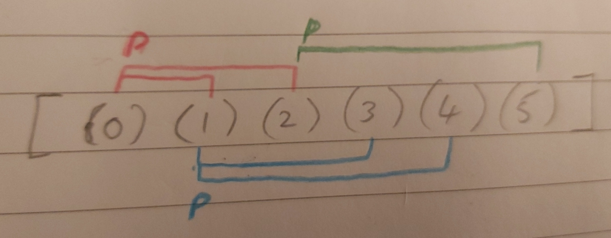

# Sorting Algorithms
## Bubble Sort

When sorting with bubble sort in ascending order, the array is iterated over and each value is compared to the next one. If the is larger than the next one then the values are swapped. So a high value near the beggining will propagate towards the end until a larger value is found, or it reaches the end of the array. This process has to be repeated multiple times so that after several iterations all of the values will have propagated so that the whole array is in ascending order.

For descending order, the values are swapped if the current value is less than the next value.

````java
class BubbleSort {
    public void bubbleSortAsc(int[] array) {
        for (int i = 0; i < array.length - 1; i++) {
            boolean modified = false;
            for (int next = 1; next < array.length - i; next++) {
                int currentVal = array[next - 1];
                int nextVal = array[next];

                if (currentVal > nextVal) {
                    array[next - 1] = nextVal;
                    array[next] = currentVal;
                    modified = true;
                }
            }
            if (!modified) {
                break;
            }
        }
    }
}
````

### Time Complexity / Space Complexity
This can take from one iteration up to as many as their are elements in the array. Therefore the time complexity may range from:

$$
O(n)
$$

to:

$$
O(n^2)
$$

Because the array is modified in place the space complexity is constant, regardless of the input array size. So the complexity is:

$$
O(1)
$$

## Merge Sort
````java
class MergeSort {
    
    private void mergeSort_merge(int[] array, int[] tempArray, int left, int mid, int right) {
        // Copy the sub-array from array defined by left and right into the same indexes of tempArray.
        for (int i = left; i <= right; i++) {
            tempArray[i] = array[i];
        }
        
        // Separate the array at the index "mid" into two sub-arrays.
        // NOTE: mid is the last index of the first array (and mid + 1 is the first of the second).
        // Iterate through the elements of two halves and add the elements in order over the original
        // values in array. Stop when either of the two halves are empty.
        int leftPointer = left;
        int rightPointer = mid + 1;
        int addedPointer = left;
        while (leftPointer <= mid && rightPointer <= right) {
            if (tempArray[leftPointer] <= tempArray[rightPointer]) {
                array[addedPointer] = tempArray[leftPointer];
                leftPointer++;
            } else {
                array[addedPointer] = tempArray[rightPointer];
                rightPointer++;
            }
            addedPointer++;
        }
        
        // Just add all of the remaining elements of the array that wasn't emptied.
        // This could be either the first or second half so we have to do both.
        int remainingPointer = leftPointer <= mid ? leftPointer : rightPointer;
        for(; addedPointer <= right; addedPointer++, remainingPointer++) {
            array[addedPointer] = tempArray[remainingPointer];
        }
    }
    
    private void mergeSortAsc(int[] array, int[] tempArray, int left, int right) {
        if (left >= right) {
            // This occurs for the cases(*) shown below.
            return;
        }

        // Find the mid part of this array.
        // Integer devision rounds down, so:
        // if (left + right) is odd (array size is even)
        //  then mid points to the lower of the middle index.
        // If (left + right) is even (array size is odd)
        //  then mid points to the middle index.
        int mid = (left + right) / 2;
        
        // Recursive calls on both the left and right sub-arrays (assuming that mid is the
        // end of the first array, and (mid + 1) is that of the second).
        // * left == mid if the input array length was 2 (left = mid = 0).
        mergeSortAsc(array, tempArray, left, mid);
        // * (mid + 1) == right if the input array length was 2 (mid = 0 -> mid + 1 = right = 1).
        // * (mid + 1) == right if the input array is of length 3 (mid = 1 -> mid + 1 = right = 2).
        mergeSortAsc(array, tempArray, (mid + 1), right);

        // Given the above cases(*), mergeSort_merge is only called with arrays of size >= 2
        // Note: mergeSort_merge must take mid as the start and end pointers of the first array
        // as all recursive calls were made with this being the case and so have been
        // sorted accordingly.
        mergeSort_merge(array, tempArray, left, mid, right);
    }
    
    public void sortArray(int[] unsortedArray) {     
        mergeSortAsc(unsortedArray, new int[unsortedArray.length], 0, (unsortedArray.length - 1));
    }
}
````

## Heap Sort
Heap sort works by building a binary tree relationship between each of the values within the array. See how the elements in the array related to each other in an array:


When building in ascending order, the heap will be structured such that each parent will be larger than both of its children. Once this is done, the largest value will always be at the front. We swap this value with the value at end. The end value is now considered "retired" as it is in the correct place and can be left. 

The heap structure algorithm is now run with the same array but without considering the retired element (so effectively it has its length decreased by 1). But the only value that is out of place at this point is the element in the first location so the algorithm only has to fix that along with any descendent nodes in the process.

This process is repeated, until all but one element has been retired. At this point the array is sorted in ascending order.

To sort in descending order the relationship between the parent nodes is reversed. So the parent in each case must be less than each of its children. In that case the first element of the array will always be sorted before it is swapped with the last index value of the array.

````java
class HeapSort {
    private void restructureHeap(int[] array, int p, int length) {
        // p is the index that references the parent node of 1-2 child nodes.
        // This *should* reference be the greatest value of all three.
        // We need to determine if this is the case and swap it the parent value
        // with the largest child value if necessary.
        // Because the child node may have been the parent of 1-2 other nodes itself
        // we then need to call this method recursively on that node as well.
        
        // Note that the children of any node is given by (2 * p) + 1
        // and (2 * p) + 2.
        
        int pVal = array[p];
        int c1 = (2 * p) + 1;
        int c2 = (2 * p) + 2;
        int swap = p;
        
        if (c1 < length && array[c1] > array[swap]) {
               swap = c1;
        }
        
        if (c2 < length && array[c2] > array[swap]) {
               swap = c2;
        }
        
        if (p != swap) {
            array[p] = array[swap];
            array[swap] = pVal;
            
            restructureHeap(array, swap, length);
        }
    }
    
    private void heapSortAsc(int[] array) {
        // Restructure heap at the from the mid-point down.
        for (int p = (array.length / 2) - 1; p >= 0; p--) {
            restructureHeap(array, p, array.length);
        }
        
        // For each element, excluding those that have been "retired" to the end
        // of the array.
        // - Swap the end with the last value
        // - restructure from just the first index as that is out of order.
        for (int length = array.length; length > 0; length--) {
            int swap = array[0];
            array[0] = array[length - 1];
            array[length - 1] = swap;
            
            int newlength = length - 1;
            restructureHeap(array, 0, newlength);
        }
        
    }
}
````

## Counting Sort
Counting sort is different from the other arrays as it relies on counting the occurrence of each value in the array. Each value is mapped to the number of occurences while at the same time the minimum and maximum values are determined.

The next step is to iterate over the entire range of values - from the minimum value to the maximum for ascending order, or the reverse for descending order. Check if any values are in the map and add that many to the array.


````java
class CountingSort {
    /**
    Create a hashmap.
    Iterate over array:
        Find the min/max values.
        Populate the map with the count of each value.
    Iterate over the range of min - max, in the direction of ordering, or until the array pointer expires.
        Check if the value is in the map
        if it is, populate the original array with as many values as is in the hashmap.
        move the array pointer each time.
    
    */
    
    private void countSort(int[] arr) {
        var countMap = new HashMap<Integer, Integer>();
        var min = Integer.MAX_VALUE;
        var max = Integer.MIN_VALUE;
        for (int i : arr) {
            min = min > i ? i : min;
            max = max < i ? i : max;
            countMap.put(i, countMap.getOrDefault(i, 0) + 1);
        }
        
        var i = 0;
        for(int val = min; val <= max && i < arr.length; val++) {
            var occurs = countMap.getOrDefault(val, 0);
            for(int j = 1; j <= occurs; j++, i++) {
                arr[i] = val;
            }
        }
    }
}
````

### Analysis


Because

### Time Complexity / Space Complexity
This algorithm is only effective when you know that the range of values is low in comparison to the length of the array. You have to iterate at least twice So the complexity is:

$$
O(n+k)
$$

Because the array is modified in place but an extra data structure is populated to hold the count values. So the complexity is:

$$
O(1+k)
$$